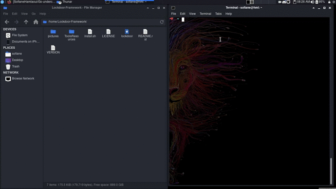
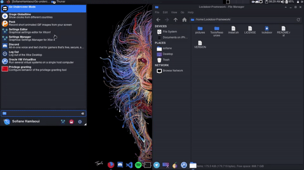

.. raw:: html

   <h1 align="center">

.. image:: go-undercover.svg

.. raw:: html

    
   GUC - Go UnderCover [Only XFCE] : 
   </h1><h2>
   Switch appearance from *-Linux to Windows
   (Kali-undercover for all distros) 
   
   
   [~] Tested on Kali,Ubuntu,Arch,Fedora,Opensuse[~]
   </h2>

=============
Overview 📙 :
=============

Everyone was happy with this new "Kali Undercover mode" on the new Kali Linux 2019.4 release. So the idea is : Why only Kali Linux, let's do it for all Linux distros ! Here comes Go-UnderCover <3. Same code,Same role, but not for one only distro.

=============
Screenshots 💻 :
=============

.. image:: https://i.imgur.com/s6vPBwD.png

============
Demos 💻 :
============
      

         
From Terminal :
==============

|FromTerm|

From Applications :
==============

|FromApps|

=============
Installation 🛠️ :
=============

         .. code-block:: console

                  git clone https://github.com/SofianeHamlaoui/Go-undercover && cd Go-undercover
                  chmod +x ./install.sh
                  ./install.sh
                  
=============
Contact Me 🤙 :
=============       

         .. list-table::
 * - Social Networks:
  :Facebook: https://facebook.com/S0fianeHamlaoui
  :Twitter: https://Twitter.com/S0fianeHamlaoui
  
 * - other:
  :Email: mailto:contact@sofianehamlaoui.me
  :Website: https://sofianehamlaoui.me
